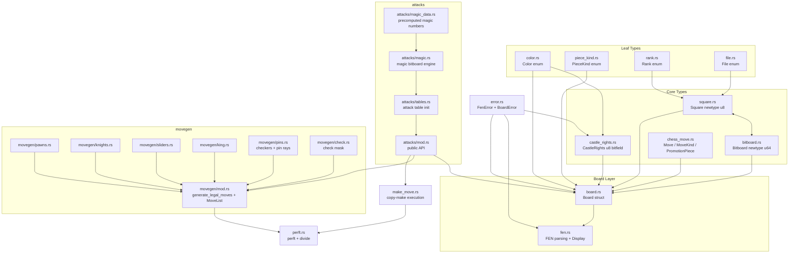

# cesso-core

Core chess types, board representation, move generation, and game rules for the cesso chess engine.

This crate provides the foundational data structures: bitboard-based board representation,
type-safe square/rank/file encodings, FEN parsing and serialization, structural validation,
attack table generation, legal move generation, and perft testing. Everything downstream
(search, evaluation) builds on these types.

## Architecture

## Glossary

| Term | Definition |
|---|---|
| **LERF** | Little-Endian Rank-File mapping. Square index = rank × 8 + file, so A1 = 0, B1 = 1, ..., H8 = 63. |
| **Bitboard** | A 64-bit integer where each bit represents one square. Enables parallel set operations on piece positions. |
| **FEN** | Forsyth–Edwards Notation. A compact string encoding of a complete chess position (piece placement, side to move, castling rights, en passant, move counters). |
| **Rank** | A horizontal row on the board (1–8, bottom to top from White's perspective). |
| **File** | A vertical column on the board (a–h, left to right from White's perspective). |
| **Algebraic notation** | Square naming by file letter + rank digit, e.g. "e4", "a1", "h8". |
| **Castling rights** | A 4-bit field tracking which sides can still castle: White king-side, White queen-side, Black king-side, Black queen-side. |
| **Magic bitboard** | A technique for fast sliding piece attack generation using a precomputed lookup table indexed by a "magic" hash of the occupied squares along a piece's rays. |
| **Perft** | Performance test — counts all leaf nodes at a given depth to verify move generation correctness. Standard benchmark for chess engine development. |
| **Pin** | A piece that cannot move because doing so would expose its own king to check from an enemy slider. |
| **Check mask** | A bitboard representing squares where a non-king piece can legally move to resolve a check (either capturing the checker or blocking the ray). |
| **Copy-make** | Move execution strategy where the entire board is copied before applying a move, preserving the original for easy undo. |
| **Carry-rippler** | A bit manipulation technique for enumerating all subsets of a bitmask, used to populate magic bitboard tables. |

## Key Types

| Type | Role |
|---|---|
| `Board` | Complete chess position: piece bitboards, side bitboards, castling, en passant, move counters. Implements `FromStr` (FEN parsing) and `Display` (FEN serialization). |
| `Bitboard` | 64-bit set of squares. Supports bitwise operators, iteration (LSB-first), and rank/file masks. |
| `Square` | A single board square (0–63, LERF). Constructed from `Rank` + `File` or algebraic notation. |
| `Color` | `White` or `Black`. Implements `Not` for flipping. |
| `PieceKind` | One of six piece types. Maps to/from FEN characters. |
| `CastleRights` | 4-bit castling state. Parses from and serializes to FEN castling field. |
| `Rank` / `File` | Board coordinates. Used to construct squares and bitboard masks. |
| `FenError` / `BoardError` | Structured error types for FEN parsing and board validation. |
| `MoveList` | Stack-allocated buffer (capacity 256) for generated legal moves. |
| `MagicEntry` | Entry in the magic bitboard lookup table (magic multiplier, mask, shift, offset). |
